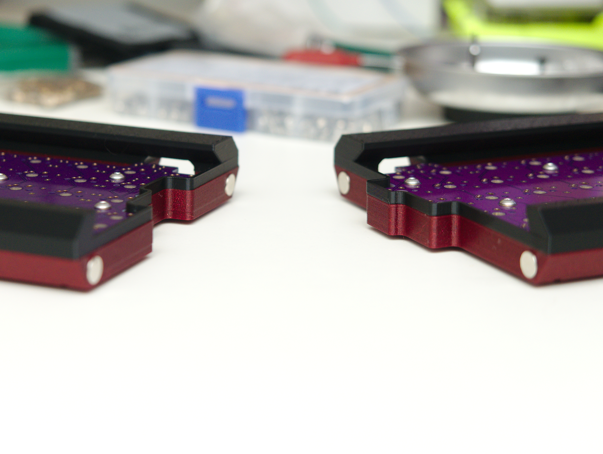

# 3D Printable Quefrency Case

For the [Quefrency - 60%/65% Split Staggered Keyboard](https://keeb.io/products/quefrency-60-65-split-staggered-keyboard)

## Notes

* The 60% layout has not been tested yet! I only own the macro + 65 percent versions of the PCBs. Please double check the dimensions before using. The screw holes *should* be the same in all versions.
* The photos show the split "wall" rising up into the top part of the case. This was removed as it tends to rattle.
* Designed to use M3 bolts and brass heat set inserts.

### Parts

* [M3 x 5mm(L) x 5mm(OD) Brass Inserts](https://www.amazon.com/gp/product/B00Y20YLKY)
* [M3 Bolts](https://www.amazon.com/gp/product/B07CYNKLT2)
* [Bumpons](https://www.amazon.com/gp/product/B01ACPT2LU) *any size is likely fine*
* [3mm x 8mm Magnets](https://www.amazon.com/gp/product/B07CPV7X8Y)